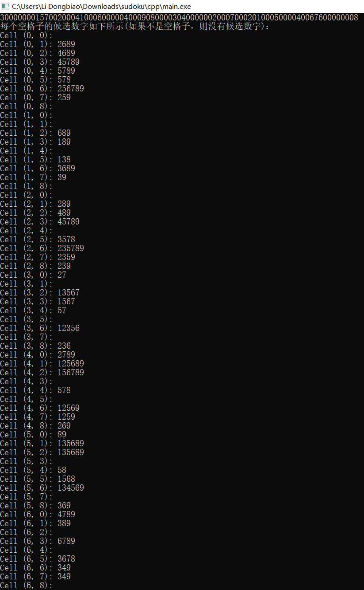
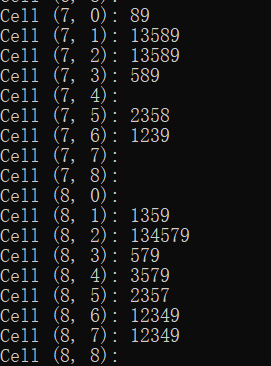
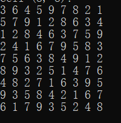
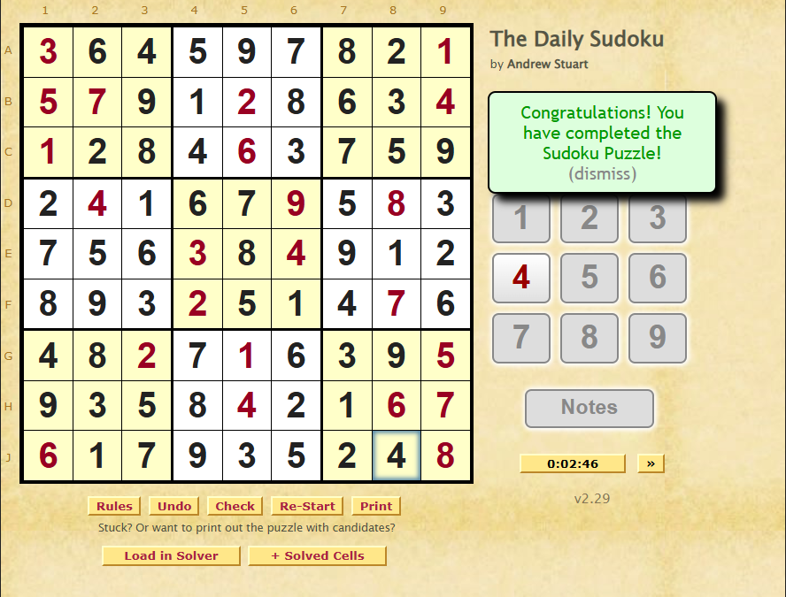

# 数独求解器项目文档

## 项目概述

本项目实现了一个简单的数独求解器，使用面向对象的编程思想（OOD/OOP）来构建代码结构。该求解器支持解析数独字符串、检查有效性、获取候选数字，并使用深度优先搜索（DFS）和回溯法来解决数独。

## 目录结构

- `Grid` 类：表示数独的基本结构。
- `Sudoku` 类：继承自 `Grid`，用于实现数独的具体功能。
- `main.cpp`（未提供）：可用于测试和展示数独求解器的功能。

## 类及其功能

### 1. `Grid` 类

- **目的**：表示一个方格（数独的基本构件），确保输入的方格是非空且为正方形。
- **主要成员**：
  - `gridMatrix`：存储方格的字符矩阵。
  - `GRID_SIZE`：方格的大小（行/列数）。
  - `BOX_SIZE`：小九宫格的大小（行/列数）。

- **构造函数**：
  - `Grid()`：默认构造函数。
  - `Grid(string grid)`：通过字符串构造方格，检查字符串的有效性。

- **主要方法**：
  - `getRow(int row)`：返回指定行的字符。
  - `getColumn(int col)`：返回指定列的字符。
  - `getBox(int row, int col)`：返回指定小九宫格的字符。

### 2. `Sudoku` 类

- **目的**：表示具体的数独实例，扩展自 `Grid` 类。
- **主要成员**：
  - `GRID_SIZE`：固定为9，表示9x9的数独。
  - `BOX_SIZE`：固定为3，表示每个小九宫格为3x3。

- **构造函数**：
  - `Sudoku()`：默认构造函数。
  - `Sudoku(string grid)`：通过字符串构造数独，初始化相关大小。

- **主要方法**：
  - `static Sudoku parse(string grid)`：解析输入字符串并返回 `Sudoku` 实例。
  - `getInference()`：获取当前数独的候选数字。
  - `solveSudoku()`：调用回溯法解决数独，返回解。
  - `backtrack(vector<vector<char>>& board)`：实现深度优先搜索和回溯算法。

## 使用示例

以下是如何使用 `Sudoku` 类解析和解决数独的示例：

```cpp
#include <iostream>
#include "Sudoku.h" // 假设你的类定义在这个头文件中

int main() {
    string puzzle = "300000001570020004100060000040009080000304000000200070002010005000040067600000008"; 
    // 示例数独
    Sudoku sudoku = Sudoku::parse(puzzle); // 解析数独
    // 获取候选数字
    vector< vector<string> > inference = sudoku.getInference();
    // 获取数独的解。 
    vector< vector<char> > solve = sudoku.solveSudoku();
    return 0;
}
```

## 错误处理

- 对于无效的输入字符串，构造函数和方法会抛出 `invalid_argument` 或 `out_of_range` 异常。
- 用户应在调用这些方法时处理可能的异常，以确保程序的健壮性。


## 输入形式
形如这样的字符串输入：
\
020014500041000020000308000904070003000000000200030405000105000060000150005980070
\
300000001570020004100060000040009080000304000000200070002010005000040067600000008


## 结果初步展示



